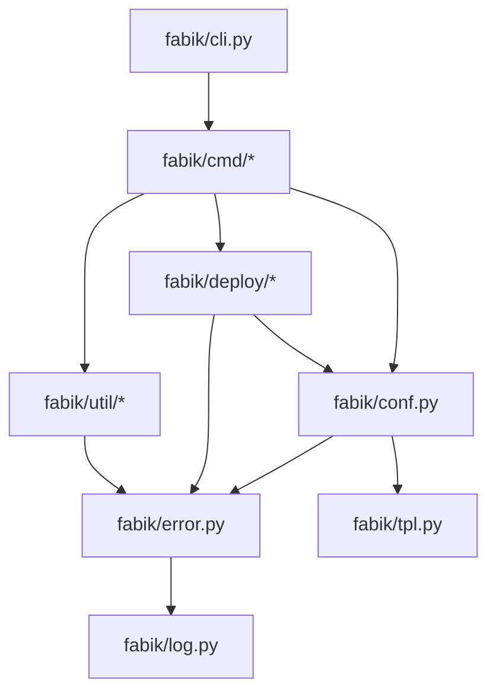

# Fabik 模块功能详细分析

## 核心模块功能

### 1. CLI 入口模块 (`fabik/cli.py`)

#### 功能概述
作为整个应用的命令行入口点，负责命令注册和路由分发。

#### 主要组件
- **main**: 主 Typer 应用实例
- **sub_gen**: 生成工具子命令组
- **sub_conf**: 配置管理子命令组  
- **sub_venv**: 虚拟环境管理子命令组
- **sub_server**: 服务器管理子命令组

#### 命令路由映射
```python
# 主命令
main.callback()(main_callback)
main.command('init')(main_init)

# 配置命令
sub_conf.command('tpl')(conf_tpl)
sub_conf.command('make')(conf_make)

# 生成命令
sub_gen.command('password')(gen_password)
sub_gen.command('fernet-key')(gen_fernet_key)
sub_gen.command('token')(gen_token)
sub_gen.command('uuid')(gen_uuid)
sub_gen.command('requirements')(gen_requirements)

# 虚拟环境命令
sub_venv.command('init')(venv_init)
sub_venv.command('update')(venv_update)  
sub_venv.command('outdated')(venv_outdated)

# 服务器命令
sub_server.command('deploy')(server_deploy)
sub_server.command('start')(server_start)
sub_server.command('stop')(server_stop)
sub_server.command('reload')(server_reload)
sub_server.command('dar')(server_dar)
```

### 2. 命令实现模块 (`fabik/cmd/`)

#### `__init__.py` - 全局状态管理

**GlobalState 类核心功能：**
- **配置管理**: 加载和验证 fabik.toml 配置
- **环境支持**: 多环境配置切换
- **路径管理**: 工作目录、输出目录管理
- **验证器系统**: 可插拔的配置验证机制
- **部署连接**: 远程部署连接管理

**关键属性：**
```python
class GlobalState:
    cwd: Path                    # 当前工作目录
    conf_file: Path             # 配置文件路径
    env: str | None             # 环境名称
    force: bool                 # 强制覆盖标志
    rename: bool                # 重命名标志
    verbose: bool               # 详细输出标志
    output_dir: Path | None     # 输出目录
    fabik_config: FabikConfig   # 配置对象
    deploy_conn: Deploy         # 部署连接
```

**验证器机制：**
- 支持注册自定义验证函数
- 内置验证器：`config_validator_name_workdir`
- 验证配置完整性和路径有效性

#### `main.py` - 主命令实现

**main_callback**: 主命令回调，处理全局参数
- 初始化 FabikConfigFile 对象
- 设置全局环境变量
- 处理命令行参数验证

**main_init**: 项目初始化命令 - 双配置文件创建
- 同时创建 `fabik.toml` 和 `.fabik.env` 配置文件
- 支持智能覆盖逻辑：
  - 检查文件存在性
  - 只对缺失的文件进行创建
  - 使用 `--force` 可覆盖已存在的文件
- 使用 Jinja2 模板渲染配置内容

#### `conf.py` - 配置命令实现

**conf_callback**: 配置命令回调
**conf_tpl**: 从模板生成配置文件
**conf_make**: 基于配置创建文件

#### `gen.py` - 生成工具命令

**生成功能列表：**
- `gen_password`: 生成随机密码
- `gen_fernet_key`: 生成 Fernet 加密密钥
- `gen_token`: 生成随机 Token
- `gen_uuid`: 生成 UUID (uuid1/uuid4)
- `gen_requirements`: 生成 requirements.txt 文件

#### `server.py` - 服务器管理命令

**server_callback**: 服务器命令回调，处理部署类选择
**server_deploy**: 部署应用到远程服务器
**server_start/stop/reload**: 服务器生命周期管理
**server_dar**: Deploy And Reload（部署并重载）

#### `venv.py` - 虚拟环境管理命令

**venv_init**: 初始化远程虚拟环境
**venv_update**: 更新虚拟环境依赖
**venv_outdated**: 检查过期的包

### 3. 配置管理模块 (`fabik/conf/`)

#### 模块重构说明
配置模块已被重构为子模块，包含：
- `__init__.py` - 模块入口和导入管理
- `storage.py` - 配置存储和数据管理
- `processor.py` - 配置处理和渲染

此外，根目录保留了 `fabik/conf.py` 作为兼容性导入文件。

#### FabikConfig 类 (storage.py)

**核心功能：**
- 双配置文件管理（fabik.toml + .fabik.env）
- 环境变量分类处理（以项目名开头 vs 非项目名开头）
- 多环境配置支持
- 配置数据获取和设置

**关键属性：**
```python
class FabikConfig:
    __project_name: str          # 项目名称
    root_data: dict              # 主配置数据
    env_data: dict               # 环境配置数据
    env_name: str                # 环境名称
    envs: dict                   # 多环境配置
```

**关键方法：**
```python
def _update_root_env_data(self)         # 合并环境配置数据
def get_env_var_name(self, var_name)    # 生成环境变量名
def getcfg(self, *args, data=FABIK_DATA) # 递归获取配置值
def setcfg(self, *args, value, data)    # 递归设置配置值
def check_env_name(self)                # 验证环境名称
def get_env_value(self, key)            # 获取环境变量值
```

#### FabikConfigFile 类 (storage.py)

**核心功能：**
- 配置文件路径管理
- 双配置文件存在性检查
- 工作目录管理
- 配置文件加载和解析

**关键属性：**
```python
class FabikConfigFile:
    __work_dir: Path            # 工作目录
    fabik_toml: Path           # TOML配置文件路径
    fabik_env: Path            # ENV配置文件路径
```

#### ConfigReplacer 类 (processor.py)

**环境变量替换系统：**
- 支持 Jinja2 模板语法
- 环境变量自动替换
- 多层配置合并
- 路径变量处理

**关键属性：**
```python
class ConfigReplacer:
    fabik_config: FabikConfig   # 配置对象
    work_dir: Path             # 工作目录
    deploy_dir: Path           # 部署目录
    replace_environ: list      # 替换环境变量列表
```

**替换流程：**
1. 获取基础配置
2. 应用环境特定配置
3. 执行变量替换
4. 渲染 Jinja2 模板

#### ConfigWriter/TplWriter 类 (processor.py)

**配置文件写入：**
- 支持多种格式：TOML、JSON、键值对
- 模板文件渲染
- 文件备份机制
- 强制覆盖控制

### 4. 部署模块 (`fabik/deploy/`)

#### Deploy 基类

**远程操作核心功能：**
- SSH 连接管理
- 远程文件操作
- 虚拟环境管理
- 进程管理
- 日志收集

**关键方法：**
```python
def remote_exists(self, file) -> bool             # 检查远程文件存在
def make_remote_dir(self, *args)                  # 创建远程目录
def cat_remote_file(self, *args) -> str           # 读取远程文件
def get_remote_pid(self, host, port) -> str       # 获取进程PID
def init_remote_venv(self, requirements_file)     # 初始化虚拟环境
def piplist/pipoutdated/pipupgrade()             # pip 管理
def put_tpl(self, tpl_name, force=False)         # 上传模板文件
def rsync(self, exclude=[], is_windows=False)    # 同步代码
def get_logs(self, extras=[])                    # 下载日志
```

#### 具体部署实现

**gunicorn.py**: Gunicorn WSGI 服务器部署
**uwsgi.py**: uWSGI 服务器部署  
**tmux.py**: Tmux 会话管理部署

### 5. 工具模块 (`fabik/util/`)

#### `gen.py` - 生成工具核心

**生成函数库：**
```python
def gen_password(length=8, chars=None) -> str      # 密码生成
def gen_fernet_key() -> str                        # Fernet密钥生成
def gen_token(length=32) -> str                    # Token生成
def gen_uuid(uuid_type='uuid4') -> str             # UUID生成
def gen_requirements_txt(dirs, exclude_dirs)       # requirements.txt生成
```

#### `encrypt.py` - 加密工具

**加密功能：**
- Fernet 对称加密
- 密钥派生
- 安全随机数生成

#### `date.py` - 日期处理

**时间工具：**
- 时间格式化
- 时区处理
- 时间计算

#### `func.py` - 通用函数库

**辅助功能：**
- 文件操作工具
- 字符串处理
- 数据结构操作

#### `jinja_filter.py` - Jinja2 过滤器

**自定义过滤器：**
- 路径处理过滤器
- 格式化过滤器
- 数据转换过滤器

### 6. 核心支持模块

#### `error.py` - 错误处理

**异常体系：**
```python
class FabikError(Exception)     # 基础异常
class ConfigError(FabikError)   # 配置异常
class PathError(FabikError)     # 路径异常  
class EnvError(FabikError)      # 环境异常
class TplError(FabikError)      # 模板异常
```

**输出功能：**
- `echo_info/warning/error`: 格式化输出
- Rich 集成的美化显示

#### `tpl.py` - 模板定义

**内置模板：**
- `FABIK_TOML_TPL`: 主配置文件模板
- `FABIK_ENV_TPL`: 环境配置文件模板 (.fabik.env)
- `SYSTEMD_USER_UNIT_SERVICE_TPL`: Systemd 服务模板

**双配置文件架构：**
- `FABIK_TOML_FILE`: "fabik.toml" - 主配置文件
- `FABIK_ENV_FILE`: ".fabik.env" - 环境配置文件

#### `log.py` - 日志系统

**日志功能：**
- 结构化日志
- 多级别日志
- 文件和控制台输出

#### `http.py` - HTTP 工具

**网络功能：**
- HTTP 客户端封装
- API 调用工具
- 错误处理

## 模块间交互关系

### 依赖关系图



### 数据流向

1. **CLI 层**: 接收用户命令，解析参数
2. **命令层**: 处理具体业务逻辑，调用核心功能
3. **配置层**: 管理配置数据，提供配置服务
4. **部署层**: 执行远程操作，管理部署流程
5. **工具层**: 提供基础工具函数
6. **支持层**: 错误处理、日志记录、模板服务

### 核心工作流程

#### 1. 项目初始化流程
```
用户执行 fabik init
  ↓
main_init 函数
  ↓  
检查双配置文件存在性
  ↓
渲染模板生成双配置内容
  ↓
智能写入逻辑：
  - 只创建缺失的文件
  - 支持 --force 覆盖
  ↓
写入 fabik.toml 和 .fabik.env 文件
```

#### 2. 配置文件生成流程
```
用户执行 fabik conf make
  ↓
加载 fabik.toml 配置
  ↓
创建 ConfigReplacer
  ↓
应用环境变量替换
  ↓
渲染 Jinja2 模板
  ↓
写入目标配置文件
```

#### 3. 远程部署流程
```
用户执行 fabik server deploy
  ↓
建立远程连接
  ↓
同步代码文件 (rsync)
  ↓
上传配置文件
  ↓
初始化虚拟环境
  ↓
启动服务
```

## 扩展点分析

### 1. 命令扩展
- 在 `fabik/cmd/` 下添加新命令模块
- 在 `fabik/cli.py` 中注册新命令
- 遵循现有的命令模式

### 2. 部署策略扩展
- 继承 `Deploy` 基类
- 实现特定部署逻辑
- 在 `DeployClassName` 枚举中添加新类型

### 3. 生成工具扩展
- 在 `fabik/util/gen.py` 添加生成函数
- 在 `fabik/cmd/gen.py` 添加命令接口
- 在 CLI 中注册新生成命令

### 4. 配置验证扩展
- 实现验证函数
- 通过 `global_state.register_config_validator()` 注册
- 集成到配置加载流程

这种模块化的设计使得 Fabik 具有良好的可扩展性和可维护性，每个模块职责明确，接口清晰，便于功能扩展和问题定位。